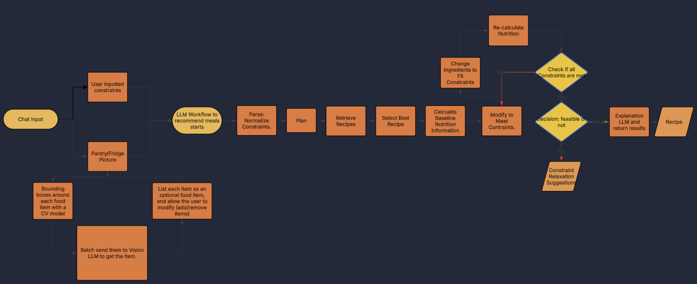
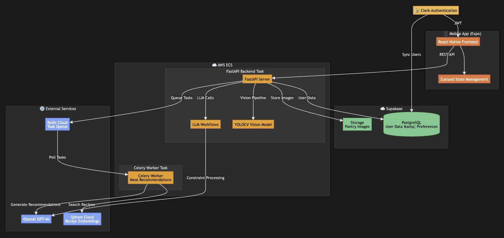

# Building Macronome: A Different Approach to Nutrition Apps

It seems like AI calorie trackers are everywhere right now. Lots of fitness enthusiasts in tech, looking to combine their passions. But personally I feel they'll fall short. Why? Well you’ve seen the demos: snap a photo of a few oreas and an LLM magically gets the nutrition exactly right. But then give it something hard, like an odd pasta-dish from a random restaurant, and it fails spectacularly. This instills distrust. You can't know when it'll be right or wrong, aside from obvious meals which you don't need an AI for anyway.

It’s impressive tech, really. It’s also often wrong.

As such, people will resort to going back to their standard manual calorie tracking apps.

But there's another problem I thought was worth tackling - deciding what to eat. Sure, we all have those moments of staring in the fridge aimlessly at 5:30pm. But more than that, there's diet limitations that we need to be mindful of. This can still be calories or macros, but other things like diet type, allergies, etc.

That’s why I built **Macronome** - an AI-powered nutrition co-pilot that helps you decide what to eat, not by counting calories, but by keeping your meals in rhythm with your goals, cravings, and what’s actually in your kitchen.

Here’s the why and how behind building it.

## The Problem: Decision Fatigue, Not Tracking Fatigue

If you’re tracking your nutrition, you know the struggle. It’s 7 PM. You have 600 calories left for the day. You need 40g of protein. You have chicken breast and spinach in the fridge. You're allergic to milk. And you’re tired.

The problem isn't tracking the meal you eventually make. The problem is **figuring out what to make in the first place** that fits all those constraints.

Most existing apps fall into two buckets:
1. **Trackers:** Great for logging history, useless for forward-looking decisions.
2. **Recipe Apps:** Great for inspiration, terrible for strict nutritional or inventory constraints.

I wanted to solve the "staring at the fridge" problem. I wanted an app that could take a messy set of constraints - *"I have 500 calories left, I want something spicy, and I need to use up this avocado"* - and give me a reliable, searchable recipe that actually fits.

## The Solution: Constraint-Based Recommendations

Macronome is built around **constraints**. Instead of just searching for "chicken recipes," you feed the system a set of hard and soft constraints:

- **Hard Constraints:** "Must be vegan," "Must be under 500 calories," "Must use ingredients I have."
- **Soft Constraints:** "I'm craving something spicy," "Should be quick to make."

The app then acts as a reasoning engine. It doesn't just hallucinate a meal; it searches a database of real recipes, filters them against your constraints, and uses an LLM to explain *why* a specific meal fits your current situation.

It’s the difference between a search engine and a recommendation engine. One gives you results; the other gives you a decision.

## The Architecture: How It Works

Building this required a hybrid approach. A pure LLM (like ChatGPT) is great at reasoning but terrible at retrieving specific, accurate nutritional data. A traditional database is great at retrieval but terrible at understanding "something spicy and quick."

So, I built a system that combines both.

### 1. The Input Layer: Vision & Text
The app accepts two types of input: natural language text and images.
- **Text:** "I want a high-protein breakfast under 400 calories."
- **Vision:** A photo of your open fridge or pantry.

For the vision pipeline, I didn't just pass the image to GPT-4o. That’s expensive and slow. Instead, I built a multi-stage pipeline:
1. **YOLO (Object Detection):** Detects bounding boxes for potential food items.
2. **Cropping:** Isolates each item.
3. **Vision LLM (Batch Prediction):** Identifies specific ingredients from the crops.
4. **User Confirmation:** You confirm what was found (because AI isn't perfect).

### 2. The Reasoning Engine: LLM + RAG
Once we have the constraints (from text or the pantry scan), we enter the "Recommender" workflow.

I use a simple RAG and LLM workflow approach:
1. **Normalize Constraints:** An LLM parses the user's request into structured data (JSON).
2. **Vector Search:** We search a Qdrant vector database of recipes (embeddings generated via OpenCLIP) to find semantic matches for recipes.
3. **Select:** We select the recipe that most closely meets all constraints.
4. **Modify:** Then we modify it to meet whatever it doesn't.
5. **Recommend and Explain:** Finally we provide the modified recipe with calorie and macro estimates, alongside an explanation of why it fits.

Here's how it flows visually.

#### The Constraint Satisfaction Loop
And what happens if no recipe perfectly fits all your constraints? Well, here's how the modification step works.

Instead of just failing, the system enters an iterative refinement loop:
1. **Baseline Calculation:** Compute the nutritional profile of the selected recipe.
2. **Constraint Check:** Compare it against your requirements (e.g., "Must be under 500 calories").
3. **Ingredient Adjustment:** If constraints aren't met, the LLM suggests swaps or portion adjustments ("Use 100g chicken instead of 150g to hit your calorie target").
4. **Recalculation:** Update the nutrition profile and check again.
5. **Feasibility Decision:** After a few iterations, if constraints still can't be met, suggest a relaxation ("Would you accept 700 calories instead?").

This loop is deterministic in its checks but probabilistic in its adjustments - combining the best of both worlds.

#### The Database: Qdrant for Semantic Search
I store ~2.3 million recipes in Qdrant, a dedicated vector database. Each recipe has:
- **Structured data:** Title, ingredients, nutrition facts, cooking time (stored in PostgreSQL).
- **Embeddings:** 512-dimensional vectors that capture semantic meaning (stored in Qdrant).

In the planning step of the workflow, an example recipe is generated to meet the needs, and a cosine similarity search over these embeddings is done to get real recipes. This leaves less room for error by the LLM to make sure we get quality meal ideas before we start modifying it.

### 3. The Tech Stack

- **Frontend:** React Native (Expo) with Zustand for state management - ensuring smooth UX even during async operations.
- **Backend:** FastAPI + Supabase - for API handling, JWT authentication, and database management.
- **Database:** PostgreSQL for structured data + Qdrant for vector search - enabling sub-second semantic search over millions of recipes.
- **ML/AI:**
    - **Celery + Redis:** Async task queue for recipe recommendation.
    - **MLflow:** Experiment tracking for the model.
    - **Docker + AWS ECS:** Containerized services deployed on AWS Fargate.

So for now, everything runs on a backend service via **FastAPI**, containerized with Docker. 

Here's a visual representation of the the architecture.

The entire infrastructure costs ~$30/month to run in production - modern ML doesn't have to be expensive if you're smart about architecture. 

## What's Still Rough Around the Edges

Let me be honest: this is a V0. It works, it's live, but it's far from perfect. Here are the main issues I'm still working through:

### 1. Diet Constraints Don't Always Hold
The most frustrating problem: the app often fails to satisfy diet requirements (vegan, keto, etc.) even though calorie constraints usually work well after a few iterations.

I built an iterative modification loop (capped at 5 iterations) that adjusts ingredients to meet constraints. This works decently for calories and macros - the final recipe usually gets within range. But diet type? It fails more often than I'd like.

**Why?** To avoid expensive nutrition APIs, I used the free USDA API for nutritional data. It works, but it's not as comprehensive or accurate. I spent so much time solving the calorie constraint problem that I didn't give diet constraints the same attention. That's the trade-off when you're building solo and trying to keep costs near zero.

**The Fix:** I need to either invest in a better nutrition API or build a more robust filtering layer that double-checks diet compliance before returning results. For now, it's a known limitation.

### 2. The Vision Model is Overeager
The YOLO model I'm using detects bounding boxes for *everything*. Including things that aren't food. This leads to cropped images of... nothing... being sent to the Vision LLM, which then returns "unknown item."

The good news: users can reject these false positives during the confirmation step. The bad news: it's annoying and makes the pantry scanner feel less magical than it should.

**Why?** I didn't have time for extensive R&D or custom training on the object detection model. I used a pre-trained YOLO checkpoint and called it good enough for V0.

**The Fix:** Fine-tuning YOLO on a food-specific dataset would help a lot. Or switching to a model trained specifically for grocery/pantry items. It's on the roadmap.

### 3. Limited Recipe Dataset
I'm using a static dataset from Kaggle with ~1 million recipes. That sounds like a lot, but in practice, it means you sometimes get obscure or low-quality results. Ideally, I'd use a live recipe API that pulls from sources like AllRecipes or NYT Cooking.

**Why?** Once again, just trying to keep costs as close to zero as possible. So, free Kaggle dataset it is, for now.

**The Fix:** Well of course if the app gains traction I'll fix this by investing in a proper recipe API. For now, 1 million recipes is... fine, I guess.

## What's Next?

Macronome is now live on the Google Play Store. While the aim for this is to be a product, I'm leaving it open source to encourage more eyeballs and opinions. It also is still early and has lots of room for improvement, including both new features and fixing existing ones.

Beyond fixing the issues above, I'm considering adding:
- **Adaptive Planning:** Learning from your history to recommend meals you actually like.
- **AI Calorie Tracking:** Well, I just trashed on these tools, but I might try to make a better one anyway.
- **Other UI/UX Improvements:** Frontend polishing, chat sessions, etc. 

If you’re interested in the code, the architecture, or just want to chat about building AI products, check out the [GitHub repo](https://github.com/ravinderrai/macronome) or connect with me on [LinkedIn](https://www.linkedin.com/in/ravibrai/).

And if you’re staring at your fridge right now wondering what to eat - maybe give Macronome a try.
