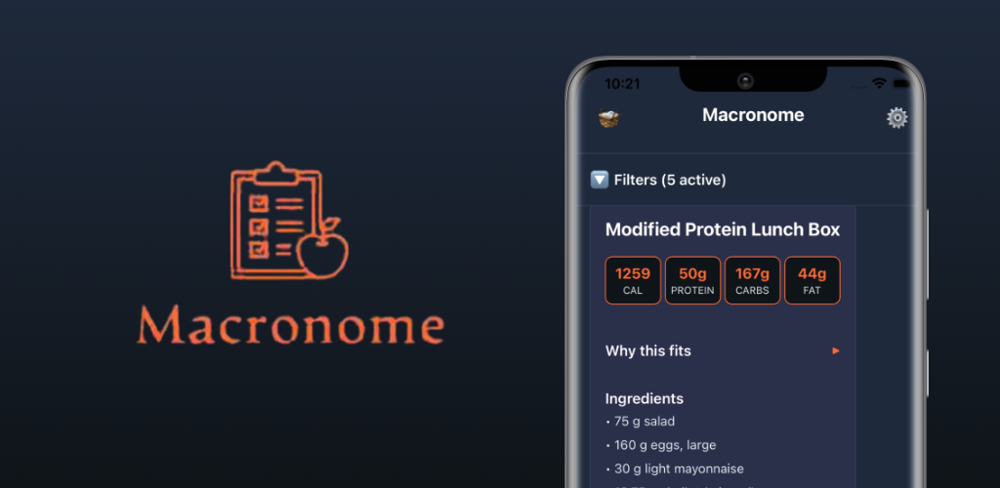

# 🥗 Macronome — Eat in Rhythm, Not in Restriction

## 🎯 What is Macronome?

**Macronome** is an AI-powered nutrition co-pilot that helps you decide what to eat next - not by counting calories, but by keeping your meals in rhythm with your goals, cravings, and what's in your kitchen.

Instead of forcing calorie counting, Macronome focuses on **balance and flow**. You describe what you feel like eating (or show your fridge), and the app recommends meals that align with your nutrition rhythm.

> *Eat in rhythm, not in restriction.*

---

<div align="center">



[](https://play.google.com/store/apps/details?id=com.macronome.app)
[](LICENSE)

</div>

---

## 💡 Philosophy

Most calorie apps make eating mechanical. Macronome makes it intuitive - helping you make good choices dynamically, not rigidly.

You don't obsessively track calories.  
You stay consistent *in rhythm* with how you actually live.

---

## 🧭 Core Features

### 🧠 AI Meal Recommendations
- Suggests meals that fit:
  - Diet type (vegan, high-protein, low-carb, etc.)
  - Remaining macros/calories (optional)
  - Cravings and prep time
  - Pantry/fridge inventory
- **Hybrid logic:** Deterministic constraint fitting + LLM reasoning for natural input ("something quick and spicy")
- **RAG-powered:** Searches a database of recipes to avoid hallucinations
  - Currently using recipes from [RecipeNLG dataset](https://www.kaggle.com/datasets/paultimothymooney/recipenlg)

### 💬 Chat-like Experience
- Conversational interface for intuitive requests
- Structured chips for key constraints (diet, cravings, time, pantry mode)
- "Add From Pantry" button for contextual recommendations

### 📸 Pantry / Fridge Vision Scan
- Snap a photo → Macronome detects what you have
- **Multi-stage pipeline:**
  1. Bounding boxes (YOLO/RT-DETR)
  2. Crop
  3. Batch predict food items with Vision LLM
- User can confirm or edit detected items before saving

### 🍽️ Meal Cards & Explanations
- Each meal includes:
  - Image, ingredients, prep time
  - "Why it fits" explanation
  - Suggested swaps (e.g. "swap rice → quinoa")
  - Full cooking instructions

---

## 🧠 Technical Highlights

### Key Technical Decisions

- **Hybrid AI Approach:** Combines deterministic constraint fitting with LLM reasoning for natural language understanding
- **RAG-based Recommendations:** Vector search over recipe database using pgvector to avoid hallucinations
- **Real-time Vision Pipeline:** Multi-stage detection (YOLO → CLIP → OCR fusion) for accurate food identification
- **Production-Ready Observability:** MLflow for experiment tracking and tracing. Grafana and Prometheus to be added.
- **Cost-Effective Infrastructure:** Runs on <$40/month while maintaining production quality

### Architecture Highlights

- **Frontend:** Expo (React Native) with Zustand state management
- **Backend:** FastAPI + Supabase (Postgres + pgvector for embeddings)
- **ML Pipeline:** YOLO object detection → CLIP embeddings → LLM reasoning
- **Infrastructure:** Docker, Celery + Redis, MLflow tracking
- **DevOps:** AWS, containerized services

---

## ⚙️ Architecture Overview

### **Frontend**
| Layer | Tech |
|-------|------|
| Framework | Expo (React Native) |
| State | Zustand / Redux Toolkit |
| Auth | Clerk Authentication |
| API | REST (FastAPI) |
| Storage | Supabase Storage (images, snapshots) |

### **Backend**

#### Managed: **Supabase**
- Postgres + `pgvector` for vector similarity search
- Auth & JWT
- Storage for images
- Row-Level Security (per-user isolation)
- Edge Functions for lightweight orchestration

#### Dockerized Services
| Service | Description |
|----------|-------------|
| **vision-api** | Detects and classifies pantry items (YOLO + CLIP + OCR + optional VLM fallback) |
| **recommender-api** | Parses constraints, retrieves recipes, and ranks results |
| **mlflow-agent-logger** | Logs LLM traces and ML experiments to MLflow GenAI |

#### Async + Compute
- **Celery + Redis** → background jobs (embeddings, retraining, batch inference)
- **Redis cache** → deduplicate expensive calls (LLM & embeddings)

---

## 📱 Platform

- **Mobile-first:** Expo (React Native)
- **Tabs:**
  - 🏠 Home (Chat + Recommendations)
  - 🕒 History
  - ⚙️ Settings
  - 🧺 Pantry Capture (modal)
- **Design language:** **Midnight Rhythm**  
  Deep navy base • coral highlights • soft white cards

---

## 🧩 Why This Stack

✅ **Full-stack ML/AI coverage** – from mobile UX → backend → models → infra  
✅ **Industry-standard tools** – Celery, Redis, MLflow, Docker, FastAPI, YoloCV  
✅ **Modern LLM practices** – Custom LLM workflows (no lame frameworks)  
✅ **Cost-effective** – Runs on <$40/month infra  

---

## 🧠 Future Roadmap

- General Improvements
- Adaptive meal planning based on user history
- Potentially AI calorie tracker

*Interested in supporting Macronome? Share feedback or contribute!*

---

## 🚀 Quick Setup (Development)

```bash
# Clone the repo
git clone https://github.com/yourusername/macronome
cd macronome

# Start backend services
docker-compose up --build

# Run Expo app
cd apps/mobile
npm install
npx expo start
```

You will also need clerk and supabase set up, alongside Qdrant for storing recipes. 

See "src/macronome/data_engineering/data_ingestion" for more on how recipe embeddings were stored.

---

## 📄 License

This project is licensed under the MIT License - see the [LICENSE](LICENSE) file for details.

---

## 👤 Author

Just trying to build cool shit.

---

<div align="center">

**[Get it on Google Play](https://play.google.com/store/apps/details?id=com.macronome.app)**

[](https://play.google.com/store/apps/details?id=com.macronome.app)

</div>
