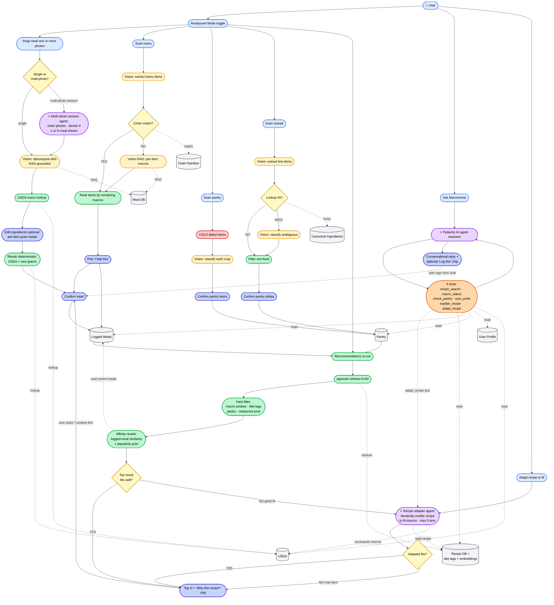
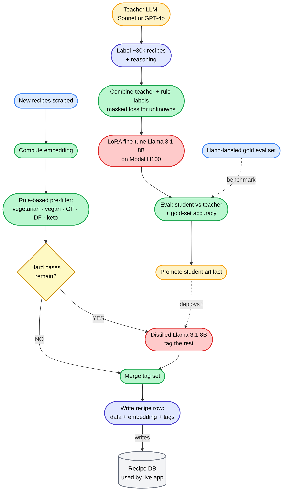

# Design: Macronome v2 — Integrated AI Macro Tracker w/ Dual-Deploy Portfolio Story

Generated by /office-hours on 2026-05-08
Branch: main
Repo: RavinderRai/macronome
Status: APPROVED
Mode: Builder

## Problem Statement

Macronome is a portfolio project. The current app (V1) has shipped on Android with a working pantry scanner and meal recommender, but lives as three siloed flows behind a polished-but-dated UX. The portfolio audience is CTOs at small startups hiring freelance ML engineers; secondary audience is generic / AWS contractor recruiters scanning resume bullets. The current state does not yet read as "this person ships end-to-end ML in production" — there is no integrated product narrative, no eval numbers, no live always-on instance to try, no production telemetry, no dual-deployment story.

## What Makes This Cool

The integration is the product. Three things people normally see as separate features collapse into one loop:

1. Snap a photo of what you ate.
2. App identifies the dish, decomposes it into ingredients with portions, computes macros, auto-logs to today's tracker.
3. Tracker shows remaining macros for the day.
4. App surfaces recipe recommendations that fit those remaining macros, optionally filtered by what's in your pantry (existing pantry scanner).
5. Cook → log → loop.

That is not an LLM-wrapper photo-to-calories app. It is a closed-loop nutrition agent powered by a coordinated ML pipeline. Layered on top: a distilled diet-tagger model that labels every recipe in the corpus (LoRA fine-tune of Llama 3.1 8B). Recommendation reranking uses content-based affinity from the user's logged-meal history (no trained model in v1; trained personalization is documented as a P2 unlock when traffic justifies it).

The other "whoa" beat is operational: the same app deploys two ways. A Terraform-managed full AWS stack (`make deploy-aws`, demo, `terraform destroy`), and a free-tier always-on stack that keeps the Play Store backend live without bills. The architecture is deploy-target-agnostic by design.

## Constraints

- Frontend: Expo on Android only, distributed via Google Play closed test. No iOS.
- Live backend must be free or near-free to run continuously. AWS deploy is on-demand for demos / blog content / interviews.
- ML must include eval numbers and production telemetry — "it works on my phone" is not enough.
- Architecture must support both deploy targets without code forks. Abstraction layers required for: LLM provider (LiteLLM), vector store, blob storage, queue/worker.
- UX is being rebuilt from scratch using `claude design` skills (`/design-consultation` → `/design-shotgun` → `/design-html`). No hand-crafted screens.
- **AI-only logging path.** The only way food enters the macro tracker is via a meal photo. No barcode scanner, no manual entry UI, no food database search. Once a meal has been photo-logged, it appears in "Recent" and is tappable for one-tap re-log — but the underlying record always traces back to a photo. This is a deliberate UX bet: the AI is the hero, not a feature.
- No phasing, no fixed timeline. Done is done.

## Premises

1. The product is one integrated flow, not three siloed features. The integration *is* the demo.
2. ML spine = three online stages (dish recognition / ingredient decomposition, recipe recommendation w/ content-based affinity rerank, pantry vision) plus one offline ML asset (distilled diet-tagger LLM, used by batch recipe ingestion). Each stage has eval set + numbers + telemetry.
3. UX is rebuilt via `claude design` against the integrated flow, not the legacy screens.
4. Dual deployment (Terraform AWS + free-tier always-on) is itself the unique portfolio hook. Architecture is deploy-target-agnostic.
5. Telemetry + evals are table stakes for "done," not stretch goals.
6. Distribution is Google Play closed test. Real testers ≥ 10 generate the data flywheel signal.

## Recommended Approach: Full Data-Flywheel Build

### Product surface

One Android app. The exact navigation layout (tab bar shape, where chat lives, whether Log is a tab or a FAB) is deferred to the `/design-consultation` and `/design-shotgun` phase. The required surfaces:

- **Today** — daily macro progress (consumed, remaining, target). Daily completion ring as the primary visual. Streak counter. Recent logged meals are tappable for one-tap re-log.
- **Log a meal** — camera capture flow only. Photo → dish identification → ingredient list with portions (Small/Regular/Large + per-ingredient gram edits) → confirm + log. Restaurant mode toggle is prominent on this screen.
- **Recommendations** — recipes that fit remaining macros (auto-computed from Today). Pantry filter toggle. Restaurant mode toggle (when on, recommends dishes from chain restaurants / restaurant-style meals; when off, home recipes). Each card shows a "Why this recipe?" chip with a 1-line rationale ("Fits 540 kcal / 38g protein remaining; uses chicken from your pantry"). Each recipe has full view + "I cooked this" log button.
- **Pantry** — existing scanner + manual edit. Feeds the pantry filter on Recommendations.
- **Ask Macronome** (chat) — natural-language query surface for recipe / food / nutrition questions. Reuses the existing 9-node meal-recommender workflow. Layout placement decided in design phase.
- **Profile / goals** — macro targets, dietary constraints, allergies. Streak history.
- **Hidden dev dashboard** — accessed via long-press on profile or a hidden gesture. Shows live MAE / MAPE on logged meals (where ground truth was corrected by the user), per-stage latency, recommendation acceptance rate. Dev-only; doubles as a portfolio screenshot artifact.

Onboarding flow: collect height / weight / activity / goal → compute macro targets → walk through camera permission → demo the photo-log path on a sample image.

**Logging path discipline.** AI-only data entry. After a meal is photo-logged, it auto-appears in "Recent" and can be re-logged in one tap. There is no manual food-database search, no barcode scanner, no quick-add UI. The underlying record always traces to a photo; the one-tap re-log just clones a prior photo-derived record.

**Restaurant mode toggle.** A first-class, front-and-center toggle (likely on Log + Recommendations screens). When ON: photo→macros uses the restaurant meal database + restaurant-style portion priors (larger portions, more oil/butter/sauce); recommendations surface chain-restaurant dishes when identifiable. When OFF: home-cooked database + standard priors; recommendations surface home recipes. The toggle is visible because it's a real product differentiator vs. generic macro trackers.

**Camera mapping by mode.** The camera always supports plated-meal photo logging (the core macro-logging mechanic) regardless of restaurant mode. The toggle changes a *secondary* affordance — the "scan environment" action:
- Restaurant mode ON → camera offers a "Scan menu" secondary action (menu-photo flow).
- Restaurant mode OFF → camera offers two secondary actions: "Scan pantry" (existing pantry scanner) and "Scan receipt" (grocery receipt → pantry stock auto-update).

Plated-meal logging is never cut by the toggle. Same camera screen, same primary button, secondary actions swap based on context.

**Receipt-scan → pantry stock.** When the user photographs a grocery receipt, the app extracts line items, maps store-specific product names to canonical ingredient names, parses quantities/units, filters non-food items (paper towels, etc.), and adds matching items to the pantry — incrementing quantities for items already there. The user gets a confirmation screen with the proposed pantry deltas and can edit before committing. Removes the most tedious step in maintaining an accurate pantry, which in turn makes the pantry filter on Recommendations actually trustworthy.

**Restaurant mode UX continuity rules** (constraints for the design phase):

1. *Same screens, different data.* Restaurant mode never changes screen layouts or navigation. It changes the data the screens are looking at (meal database, recipe pool) and the secondary affordances available. The visual language stays the same.
2. *Subtle persistent visual cue, not a context-switch banner.* A small accent — tinted toggle pill in the top bar, or a "🍴 Restaurant" chip near the screen title. Enough that the user knows the state; not so much that it feels like a different app.
3. *Toggle lives in the top bar of relevant screens (Log + Recommendations), not in settings.* Persists across sessions. Optional stretch: auto-prompt when device location is detected as a restaurant.
4. *Restaurant-only affordances appear contextually within standard screens, never as new screens or tabs.* Menu-scan button shows up inside the camera flow when restaurant mode is on; chain-detected items appear as enhanced cards within the standard Recommendations layout.

**Streaks + daily completion ring.** Streak = number of consecutive days where the user logged at least one meal. Daily completion ring = visual progress toward macro targets (kcal + protein at minimum). Push notifications nudge meal-time logging and surface "you're 200 kcal / 15g protein from closing today's ring."

### ML system

**Online stages (request-time):**

1. **Dish recognition + ingredient decomposition (plated-meal photo)** — photo → dish embedding (CLIP or DINOv2) → vector search against meal database (home OR restaurant, depending on Restaurant mode toggle) → top-k similar meals → LLM (via LiteLLM) decomposes target dish into ingredients with portion estimates, RAG-grounded against the retrieved meals. Restaurant mode applies restaurant-style portion priors (larger servings, higher oil/butter/sauce). For chain restaurants where identifiable, prefer published chain nutrition data over LLM estimation. Output: structured ingredient list with grams.
2. **Nutrition computation** — USDA lookup per ingredient → sum macros → return total + per-ingredient breakdown. Deterministic; no ML.
3. **Recipe recommendation** — given (remaining macros, dietary constraints + diet-type hard filters, optional pantry contents, Restaurant mode), retrieve recipes from Qdrant (or free-tier alternative), filter by macro window (±10%) and diet-type tags (hard filter — no recipe with conflicting tags surfaces), rank by content-based affinity (see offline #3): logged-meal embedding centroid similarity + popularity prior + diet/cuisine affinity from profile. Each result carries a 1-line rationale string ("fits remaining macros; uses pantry items X, Y") rendered on the "Why this recipe?" chip.
4. **Pantry vision (existing)** — YOLO detection → crop → VLM classification.
5. **Menu-photo flow (restaurant mode ON, secondary camera action)** — VLM (e.g., GPT-4V or Claude Sonnet vision) extracts structured menu items from a menu photo: `[{name, description, price}]`. Chain detection step: match menu signature against known-chain database; if match, fetch published chain nutrition data per item. If no match (independent restaurant): each item runs through a text-grounded variant of stage 1 — vector search the item description against the meal database, RAG-decompose with restaurant priors, return per-item macros. Then rank items by fit-to-remaining-macros (same logic as recipe recommendations). User picks an item → tap "I had this" → it auto-logs as a meal entry, traceable back to the menu photo (preserves AI-only logging discipline).

6. **Receipt-scan → pantry stock (restaurant mode OFF, secondary camera action)** — VLM extracts line items from a grocery receipt photo: `[{raw_item_name, quantity, unit, store_name_hint}]`. A normalization step maps store-specific abbreviations (e.g., "TJ ORG TOMATO RM" → "tomato") to canonical ingredient names — implemented as a fuzzy-lookup against the canonical ingredient catalog plus an LLM fallback for items the lookup misses. Quantity parsing handles common units (lb, oz, count, "EA", numeric prefixes). A non-food filter removes line items that don't map to any ingredient (paper towels, household goods, etc.). The result is a proposed pantry-delta list (new items + quantity increments for existing items). The user reviews on a confirmation screen, edits if needed, then commits. Receipt photo is retained for audit + eval.

**Offline ML assets:**

1. **Rule-based diet pre-filter** — deterministic ingredient-list rules applied to every recipe at ingestion. Handles the easy cases at zero inference cost: vegetarian (no meat), vegan (vegetarian + no eggs/dairy/honey), pescatarian (vegetarian + fish), gluten-free (no wheat/barley/rye/spelt), dairy-free (no dairy ingredients), keto / low-carb (computed from macros). Output is a partial label set per recipe — covers ~70% of labels at high precision, leaves the harder cases to the distilled LLM.

2. **Recipe diet-tagger — distilled small LLM** (the "tagger"). Architecture:
   - **Teacher:** frontier LLM (GPT-4o-class or Claude Sonnet) labels a curated seed set of ~20–50k recipes with full diet-tag set + reasoning. Includes the hard / ambiguous cases (fusion cuisine, sauces, prep methods) the rule pre-filter can't decide. One-time labeling cost (~$30–$80).
   - **Data acquisition:** combine teacher-labeled seed + targeted scraping of diet-specific recipe sites (vegan-only blogs, keto-only sites, etc.) for free positive labels; use rule pre-filter to fill in computable labels for those scraped recipes; mask unknown labels in training loss.
   - **Student:** small open LLM (Llama 3.1 8B / Qwen 2.5 7B / similar 3B–8B class), fine-tuned via LoRA on the teacher labels.
   - **Eval:** student-vs-teacher agreement on held-out test set + a hand-labeled gold set (~500 recipes) for absolute accuracy.
   - **Inference:** student runs at ingestion time over the full recipe corpus (RecipeNLG ~2.2M, plus targeted scrapes). Per-recipe inference cost is fractions of a cent — orders of magnitude cheaper than running the teacher.
   - **Why distillation, not a multi-label classifier:** stronger portfolio narrative ("distilled a frontier teacher into a fine-tuned 7B student"), handles ambiguous cases (fusion cuisine, sauces, regional dishes) that ingredient-classifier approaches miss, demonstrates a full modern fine-tuning pipeline (LoRA, dataset curation, eval harness, deployed serving).
   - **Retraining pipeline:** triggered on new recipe ingestion volume threshold or eval drift. Teacher re-labels a fresh ambiguous slice; student re-trains.
   - Outputs feed the recommendation filter (diet-type hard filter) and improve retrieval relevance.

3. **Affinity reranking (no trained model — eng review revision).** Original scope was a trained implicit-feedback personalization model (matrix factorization or two-tower); dropped during eng review because portfolio scale (~10–15 testers) doesn't generate enough data for a meaningful trained model. Replaced with: content-based affinity inside the live recommender — cosine similarity between the user's logged-meal embedding centroid and candidate recipes, plus a global popularity prior, plus diet/cuisine affinity from explicit profile. ~50 lines of code, zero model training, works at 1 user. The trained-model upgrade path is documented as a future P2 in `TODOS.md` for when traffic justifies it.

**Agentic features (three flows where the LLM owns control flow):**

4. **Chat reasoner agent (Ask Macronome).** Pydantic AI agent with 6 tools (`recipe_search`, `macro_status`, `check_pantry`, `user_prefs`, `explain_recipe`, `adapt_recipe`). Sonnet decides which tools to call based on the user's natural-language query, may iterate. Returns conversational reply with optional "Log this" chip that hands off to the same confirmation flow as the camera entries.

5. **Multi-photo meal session agent.** When the user takes more than one photo in a single logging session (common at restaurants: salad + entree + dessert; or home meals with sides), this agent decides: are these N separate meal entries, or one composite meal with N components? Chains the photo→macros pipeline once per photo, then either creates N log entries with shared session metadata or merges into one composite entry. Avoids forcing the user to log each plate separately when the meal is conceptually one thing. Differentiator vs. typical AI-calorie-tracker apps that assume 1 photo = 1 meal.

6. **Recipe adapter agent.** When the recommendation flow's top result doesn't fit remaining macros cleanly (or when the user explicitly requests "adapt this recipe" via the standalone entry point or the chat tool), this agent iteratively modifies a recipe to fit the macro target. Substitutes ingredients (brown rice → cauliflower rice to drop carbs), adjusts portions, swaps proteins. Bounded loop (max 5 iterations). Output: an "adapted variant" of the original recipe with delta annotations ("this version uses X instead of Y; macros now fit your remaining 540 cal / 38g protein"). Revives the modification-loop behavior from the original 9-node DAG that genuinely improved acceptance rates. Three entry points: inside Recommendations (auto-invoked when no good fit), standalone "Adapt to fit" entry on a recipe view, and `adapt_recipe` chat tool.

**Human-in-the-loop ingredient editor (NOT agentic — deterministic recalc):**

7. **Ingredient-edit step (between AI macro estimate and final log).** After the photo→macros pipeline produces an ingredient list with portion estimates, the user sees an editable list. They can: change the gram weight of any ingredient (e.g., AI guessed 4oz salmon, user knows it was 6oz), remove an ingredient the AI hallucinated, or add an ingredient the AI missed. **Recalc is deterministic for gram changes** (USDA × new grams = new macros). For added ingredients without a USDA match, falls back to a small LLM call to map the ingredient to the canonical USDA database. Final macros reflect the user's edits. This is the "AI confident estimate + human-confident overrides" pattern — preserves the AI-only-data-entry discipline (you can't *type* a meal) but lets the user correct what they know better than the model.

**Eval harness (per stage):**

- Dish recognition (plated meal): top-1 / top-5 accuracy on a labeled set of N meal photos.
- Ingredient decomposition: F1 on ingredient list vs. ground-truth.
- Macro estimation: MAE / MAPE on total kcal, protein, carb, fat vs. ground-truth.
- Recipe diet-tagger (distilled LLM): per-label F1 on held-out gold set, plus student-vs-teacher agreement on a held-out teacher-labeled set.
- Menu OCR / extraction: F1 on item extraction vs. ground-truth menu structure.
- Menu chain detection: precision / recall on a labeled set of chain menus.
- Per-item macro estimation (menu mode): MAE on chain items where published nutrition is the ground truth.
- Receipt OCR / line-item extraction: F1 on item extraction vs. ground-truth receipt structure (across major grocery chain receipt formats).
- Receipt ingredient normalization: accuracy on store-name → canonical-ingredient mapping (precision and recall against a labeled mapping set).
- Receipt non-food filter: precision (don't add paper towels to pantry) and recall (don't filter real food).
- Affinity rerank: A/B comparison of "with affinity rerank" vs "without" (popularity-only baseline) on synthetic preference pairs from the eval set. Honest acknowledgment that real NDCG@k requires more users than portfolio scale provides.
- Recipe adapter: success rate (does the adapted recipe actually fit the macro target within ±10% after the loop?), iterations-to-fit distribution, eval against a synthetic set of (recipe, target macros) pairs.
- Multi-photo session agent: precision/recall on session-boundary decisions (1 composite vs N entries) against a labeled set of multi-photo sessions (collect ~30 examples while building).
- Ingredient-edit recalc: unit tests on the deterministic recalc (no eval set needed); F1 on the LLM fallback for added-ingredient → USDA mapping.
- Pantry vision: detection mAP + classification accuracy on labeled pantry photos.

Eval set is checked into the repo; CI runs evals on every PR touching the relevant stage.

### Architecture (deploy-agnostic)

Abstraction layers, each with two implementations (AWS + free-tier):

- **LLM provider:** LiteLLM. AWS = Bedrock. Free = OpenAI direct / Together / Groq.
- **Vector store:** abstract interface. AWS = OpenSearch Serverless or self-hosted Qdrant on ECS. Free = Qdrant Cloud free tier or pgvector on Supabase.
- **Blob storage:** AWS = S3. Free = Supabase storage / Cloudflare R2.
- **Database:** AWS = RDS Postgres. Free = Supabase Postgres (already in stack).
- **Queue / worker:** AWS = SQS + Step Functions (planned migration from Celery). Free = Redis (Upstash free tier) + a worker process on Fly.io / Railway.
- **API:** AWS = ECS Fargate or Lambda. Free = Fly.io or Railway free tier.
- **Auth:** Clerk (already cross-environment).
- **Telemetry:** OpenTelemetry exporter, target-swappable. AWS = CloudWatch. Free = Grafana Cloud free / Honeycomb free / self-hosted.

Configuration via env vars + a `DEPLOY_TARGET` switch in settings.py. Same code, two deploys.

### Deployment

**AWS via Terraform.** A `terraform/aws/` module that provisions: VPC, ECS cluster, ALB, RDS, OpenSearch (or Qdrant on ECS), S3 buckets, SQS, Step Functions state machine for the meal-recommender workflow, CloudWatch dashboards, Secrets Manager. `make deploy-aws` runs `terraform apply`; `make destroy-aws` runs `terraform destroy`. Used for blog content, interview demos, recruiter walk-throughs.

**Free-tier always-on.** Specific stack to be researched and locked during the infra phase. Candidates: Fly.io (compute) + Supabase (Postgres + storage) + Upstash (Redis) + Qdrant Cloud free tier (vectors). This is the live backend for the Play Store closed test.

Both deploys run from the same Docker image, switched by `DEPLOY_TARGET`.

### Telemetry

Production observability is not optional. Required dashboards:

- Inference latency per ML stage (p50 / p95 / p99).
- Inference cost per request (model + tokens + cents).
- Error rate per route + per ML stage.
- Eval drift (compare production prediction distributions against eval set).
- User funnel: photo captured → identified → confirmed → logged.
- Recommendation acceptance rate.

OTel instrumentation in the FastAPI handlers; each stage tagged. Structured logs with request IDs.

### Design rebuild

Use `/design-consultation` to define the design system (typography, color, spacing, motion, component primitives), generating `DESIGN.md` as the source of truth. Use `/design-shotgun` to explore variants of the core screens (Home / Today, Log a meal, Recommendations). Use `/design-html` to finalize approved mocks into reference markup. Translate to Expo / React Native components.

Reference DESIGN.md for any UI work going forward.

## Open Questions

1. **Free-tier always-on stack — exact components.** Research current limits / pricing of Fly.io, Railway, Render, Supabase, Upstash, Qdrant Cloud, Cloudflare Workers. Lock during infra work.
2. **Vector store on AWS — OpenSearch Serverless vs. self-hosted Qdrant on ECS.** OpenSearch is more "AWS native" but pricier; Qdrant on ECS is portable to free-tier. Decide based on Terraform module complexity vs. consistency-with-free-tier.
3. **Eval set sourcing.** Need ~200 photos with ground-truth ingredients + macros for photo→macros eval, split across home and restaurant categories. Source: cook own meals + log carefully? Use Nutrition5k where coverage allows? MenuStat for restaurant ground truth? Hybrid.
4. **Recipe DB scale.** 5–10k recipes per plan.md, plus a separate restaurant meal database (Nutrition5k + MenuStat + chain-published data). Source list TBD. Tagger seed labels via LLM, then human-corrected.
5. ~~**Personalization cold start.**~~ **RESOLVED in eng review:** dropped trained personalization model from v1; replaced with content-based affinity rerank (no training). Trained model is a P2 in `TODOS.md` for when traffic justifies it.
6. **Auth in dual deploy.** Clerk works cross-target but has its own cost. Verify free-tier limits remain acceptable.
7. **Step Functions vs. keeping Celery on AWS.** Step Functions = stronger AWS portfolio signal but adds infra surface. Celery already works.
8. **Navigation layout.** Tab bar shape, where chat lives, whether Log is a tab or a center FAB — deferred to `/design-consultation` and `/design-shotgun`.
9. **Restaurant mode default state.** Off by default and user toggles? Or auto-detect from photo (e.g., if photo is taken in a restaurant context, prompt the toggle)? Auto-detection is cooler but adds another model.
10. **One-tap re-log auto-save semantics.** Does every photo-logged meal go to "Recent"? Or only meals the user explicitly logged after editing? Need a heuristic to keep "Recent" useful and not noisy.
11. **Distilled tagger student model choice.** Llama 3.1 8B vs. Qwen 2.5 7B vs. a smaller 3B variant. Tradeoff is accuracy vs. inference cost vs. fine-tuning ease. Lock during the fine-tuning phase based on eval numbers and free-tier hosting constraints.
12. **Menu-photo VLM choice.** GPT-4V vs. Claude Sonnet vision vs. open-weights VLM (e.g., Qwen-VL). Cloud VLMs are higher-quality on menu OCR + structured extraction; open-weights are cheaper / more portable. Likely cloud VLM via LiteLLM for v1.
13. **Chain restaurant database.** Need a chain-menu corpus + nutrition data for chain detection + lookup. MenuStat is the obvious starting point; supplement with scraped chain nutrition pages (Chipotle, Sweetgreen, etc.) and define how matches are scored.
14. **Diet-tag scope at launch.** Vegan, vegetarian, pescatarian, gluten-free, dairy-free, keto, paleo are obvious. What about whole30, low-FODMAP, mediterranean, halal, kosher? More tags = more value but more labeling + eval surface.
15. **Receipt format coverage.** Receipts vary wildly across grocery chains (Trader Joe's, Whole Foods, Costco, Walmart, regional chains). Need representative receipts in eval set across the most common chains. Lock chain coverage during eval-set sourcing.
16. **Canonical ingredient catalog.** Receipt normalization needs a canonical ingredient namespace to map into. Reuse the existing pantry / USDA ingredient list, or build a separate catalog tuned for grocery items? Probably reuse and extend.
17. **Receipt scan + pantry consent.** Receipts contain payment info, store loyalty IDs, sometimes addresses. Strip / never-store sensitive fields at ingestion. Define what is retained vs. discarded.
18. **Multi-photo session detection.** How does the app know the user is starting a multi-photo session vs. taking a second photo of the same dish? Options: explicit "+ another photo" button after the first capture; time-based grouping (photos within N minutes of each other in the same session); explicit session-start gesture. Also: how does the agent decide N entries vs 1 composite entry — heuristic based on visual similarity, or always ask the user?
19. **Recipe adapter trigger thresholds.** What counts as "doesn't fit well" for the auto-adapter? Hard threshold (e.g., gap > 100 kcal or > 10g protein from remaining macros)? Soft trigger that surfaces an "adapt this?" suggestion rather than auto-running? Auto-run risks burning LLM tokens on edge cases; soft trigger needs UX design.
20. **Recipe adapter LLM choice.** Sonnet (high quality, more expensive per iteration loop) vs. Haiku (cheaper, may need more iterations). Worth measuring: is the loop length actually shorter with Sonnet, making total cost similar?
21. **Ingredient-edit fallback for added items.** When the user adds an ingredient that doesn't fuzzy-match the USDA catalog, the LLM fallback maps it. What's the failure mode if even the LLM can't map it? "Unknown ingredient — log without it" vs. "store as freeform with zero macros" vs. block the log.

## Success Criteria

- Single Android app on Play Store closed test (≥ 10 active testers).
- Integrated flow works end to end: photo → log → see remaining → get recs → cook → log.
- AI-only logging path is enforced. No manual food-entry UI exists. Plated-meal photo logging works regardless of restaurant mode.
- Restaurant mode toggle is a first-class, prominent UI element. Switching it visibly changes (a) the photo→macros priors, (b) the recommendation pool, and (c) the secondary camera affordance ("Scan menu" when on, "Scan pantry" when off).
- Menu-photo flow works end to end: scan menu → extract items → chain-detect or estimate per-item macros → rank by remaining-macro fit → user picks → auto-logs.
- Receipt-scan flow works end to end: scan receipt → extract line items → map to canonical ingredients → filter non-food → propose pantry deltas → user confirms → pantry updated.
- Diet-type filter is a hard filter on recommendations (never surfaces conflicting recipes). Set during onboarding; editable in profile.
- Recipe diet-tagger (distilled small LLM) trained, evaluated against teacher + gold set, deployed for batch labeling at recipe ingestion.
- Streaks + daily completion ring functional. Push notifications fire for meal-time nudges.
- "Why this recipe?" rationale chip shipped on every recommendation card.
- Hidden dev eval dashboard accessible inside the app, showing live MAE/MAPE + per-stage latency.
- All ML stages have eval numbers checked into the repo and published in the README.
- Both deploy paths green: `make deploy-aws` brings up a working AWS stack from zero; `make deploy-free` (or equivalent) keeps the live backend running on free tier.
- Production telemetry dashboards exist and show real traffic.
- Recipe tagger model trained, evaluated, deployed, used in retrieval.
- Affinity rerank shipped (logged-meal embedding centroid + popularity prior + diet/cuisine affinity from profile). Trained personalization model documented as P2 future work in `TODOS.md`, not in v1 scope.
- **Recipe adapter agent** functional in all three entry points: auto-invoked inside Recommendations when no candidate fits well, manually triggered from a recipe detail view ("Adapt to fit"), and exposed as the `adapt_recipe` chat tool. Bounded loop (max 5 iterations). Adapted variants are clearly labeled as "adapted from X" on the user-facing card.
- **Multi-photo meal session agent** functional. Taking 2+ photos in a logging session triggers the session agent, which decides whether to create N separate meal entries or 1 composite entry. Session boundary detection works (UX answer locked during design phase).
- **Ingredient-edit step** functional on the photo→macros confirmation screen. User can adjust per-ingredient grams; macros recompute deterministically (USDA × new grams). User can remove or add ingredients; added ingredients map to USDA via fuzzy lookup with LLM fallback.
- Architecture is deploy-target-agnostic — verified by both deploys being live.

## Distribution Plan

- **Frontend:** Expo build → Google Play closed test track. Internal testing list of ~10–15 people. EAS for builds.
- **Backend (always-on):** Free-tier stack hosting the production API used by the Play Store app. Domain + TLS.
- **Backend (AWS demo):** Stood up via Terraform on demand. Documented with a one-paragraph "how to spin this up in 15 minutes" in the repo README.
- **Code:** Public GitHub repo. README is the portfolio landing.

## Next Steps

Concrete first work units (no order implied beyond logical dependency — pick what unblocks the most when you sit down):

- Run `/design-consultation` to lock the design system. Output: `DESIGN.md`.
- Run `/design-shotgun` against the integrated flow to explore Home / Log a meal / Recommendations variants.
- Stand up the abstraction layers in `src/macronome/backend/` (LLM via LiteLLM, vector store interface, blob storage interface, queue interface). Confirm everything still works against current Supabase / Qdrant / OpenAI defaults.
- Research and lock the free-tier always-on stack. Write a `terraform/free/` shim or equivalent infra-as-code so it is reproducible.
- Build the `terraform/aws/` module. `make deploy-aws` / `make destroy-aws`.
- Build the eval harness scaffolding: directory structure for labeled data, eval scripts per ML stage, CI workflow.
- Build the recipe tagger training pipeline (data loader, model, eval, retraining trigger).
- Build the content-based affinity rerank inside the live recommender (no training pipeline; reads recent logged meals + computes centroid similarity + applies popularity prior + applies diet/cuisine affinity from profile).
- Migrate the meal recommender workflow to Step Functions on AWS (keep Celery as the free-tier path or unify).
- Rebuild the Android UI on top of the new design system + integrated flow.
- Wire OTel telemetry through every stage. Stand up dashboards on both targets.
- Recruit testers. Ship to Play Store closed test.

## What I noticed about how you think

- You corrected my framing twice in this session — once on scope (rejecting "feature vs rigor" as a false choice and saying "build it all end-to-end impressive"), and once on phasing (rejecting timelines and blog posts and saying "stop when we're done"). That is conviction. You knew what you wanted; my job was to get out of the way.
- You named your audience with unusual specificity. "Freelance CTOs at small startups, plus generic / AWS recruiters where it's resume-bullet material" is sharper than what most people give in a portfolio conversation. You know who you are selling to.
- You said the hook is the end-to-end shipping story before I had to push for it. That self-awareness about what differentiates you in a market full of "I built a chatbot" portfolios is itself a CTO-readable signal.
- You instinctively reached for portability — dual deploy, two backends, same code — without me suggesting it. That is operational ML-engineer thinking, not "I built a model" thinking. Lean on it. The dual-deploy story is the part of this project that the average AI portfolio cannot copy.

## AI Architecture Map

End-to-end view of every AI/ML flow. Two diagrams: **the live app** (everything user-facing — camera flows, chat, recommendations, all converging through confirmation into the data stores and looping back) and **the offline pipelines** (the data flywheel that keeps the live app fresh).

### Style summary

- **Live app is mostly structured pipelines** with LLMs as components, not orchestrators. **Three named agentic flows** (purple nodes): chat reasoner, multi-photo session agent, recipe adapter agent. Each has a clear use case where execution path genuinely depends on intermediate results.
- **Offline pipelines are the (one-directional) data pipeline:** diet-tagger fine-tune → recipe ingestion → Recipe DB → live app reads. Bidirectional flywheel (logged meals → trained personalization → reranking) is documented as a future P2; not in v1 because portfolio scale doesn't generate enough data to train a meaningful model.
- **RAG corpora:** *meal database* (photo→macros, menu independent-restaurant) and *recipe corpus* (recommendations, chat, recipe adapter).
- **Determinism wherever possible:** USDA macro lookup, hard diet-tag filter, macro window math, ranking, ingredient-edit recalc — no LLM cost for arithmetic.
- **Human-in-the-loop where it adds confidence:** ingredient-edit step on the meal-log path lets the user override per-ingredient grams (deterministic recalc). The AI is the hero, but the user gets the final say on portions they know better than the model.

### Diagram 1 — The live app

Everything user-facing in one connected flow. Five entry points (four camera modes + chat), each running through its own pipeline, all converging at the confirmation layer, writing to Logs/Pantry, which trigger Recommendations, which loop back to the user.

### Diagram 2 — Offline ML pipelines (data flywheel)

Two batch pipelines that feed the live app: **diet-tagger fine-tune** produces the distilled Llama 3.1 8B that **recipe ingestion** then uses to label every scraped recipe. The output is the Recipe DB that the live app reads from for both recommendations and chat.

**Note on personalization:** A trained personalization model (matrix factorization / two-tower from implicit feedback) was scoped during office hours but **dropped during eng review** because it doesn't work at portfolio scale (~10–15 testers produces too little data for a meaningful model). Replaced with content-based affinity reranking inside the live app (logged-meal embedding centroid + popularity prior + diet/cuisine affinity from profile). No offline training. Documented as a future P2 in `TODOS.md` for when traffic justifies it.

### Legend (both diagrams)

- 🟦 **Blue** = user action / external input
- 🟨 **Yellow** = off-the-shelf LLM call (Sonnet vision, etc.)
- 🟥 **Red** = fine-tuned model (YOLO pantry detector, distilled Llama)
- 🟪 **Purple** = agent reasoner (the one autonomous LLM in the system)
- 🟧 **Orange** = chat agent's callable tools
- 🟩 **Green** = deterministic compute (no AI)
- 🟦 **Indigo** = user confirmation step
- 🟨 **Light yellow** = decision branch
- ⬜ **Gray** = data store

### How the two diagrams connect

One load-bearing junction links them: **Recipe DB** (Diagram 2 → Diagram 1). Offline tagger fine-tunes the model; recipe ingestion uses it to label every scraped recipe; the resulting Recipe DB is what the live recommender retrieves from and the chat agent searches via `recipe_search`.

The "data flywheel" in this scoped version is one-directional (offline → live, not yet live → offline as feedback). The future-state flywheel — logged meals feeding a personalization retrain — is documented in `TODOS.md` as a P2 unlock for when traffic justifies a trained model. At portfolio scale (10–15 testers), the live affinity rerank reads recent logged meals directly without an intermediate trained model.

### Where Pydantic AI earns its keep

- **Chat agent** (purple node in Diagram 1) — full agent loop with autonomous tool selection. Pydantic AI's strength.
- **All other LLM calls** (yellow nodes) — use Pydantic AI's typed-LLM-call primitive (`agent.run(prompt, output_type=Schema)`), but **not** the agent loop. Each pipeline node is a typed function call.

This means the architecture commits to **Pydantic AI for everything LLM, plain Python for orchestration, no separate workflow framework** (no LangGraph, no Burr, no custom DAG runner). Pipelines are short (2–5 steps each), state is simple, retries fit at the LLM-call level. The complexity doesn't justify a workflow framework on top.

## Locked Decisions (Eng Review 2026-05-10)

Architectural choices locked during `/plan-eng-review`. Each gets an ADR written in `docs/adrs/` as it's implemented.

1. **Workflow framework: Pydantic AI** (ADR-001). Migrate the 9-node DAG from boilerplate to Pydantic AI; build new ML pipelines on Pydantic AI from day one. Rationale: type-safety, model-agnostic via own provider abstraction (no LiteLLM dependency), strong modern signal, fixes boilerplate-NIH. Risk: API maturity is good-not-great; expect minor refactors.

2. **Free-tier always-on stack:**
   - API + worker: **Fly.io** (free shared-CPU VMs)
   - Database: **Supabase Postgres** (kept warm via GitHub Actions cron pinging every 10 min)
   - Vector store: **pgvector on Supabase** (consolidated DB)
   - Cache + queue broker: **Upstash Redis** (free tier; cache discipline required)
   - Blob storage: **Cloudflare R2** (10 GB free + no egress fees)
   - LLM provider: **Anthropic + OpenAI direct** (via Pydantic AI's own model abstraction; no LiteLLM)
   - Distilled tagger inference: **Modal** (free credits + GPU on-demand)

3. **AWS deploy stack:**
   - API + worker: ECS Fargate (Terraform-managed)
   - Database: **RDS Postgres + pgvector** (symmetrical with free tier)
   - Cache: ElastiCache Redis or in-Fargate Redis
   - Blob storage: S3
   - LLM: same providers as free
   - Distilled tagger inference: SageMaker endpoint
   - Workflow orchestration: **Step Functions** (replaces Celery on AWS only)

4. **Workflow orchestration abstraction:** Celery on free deploy, Step Functions on AWS. Both implement a single `QueueRunner` interface so workflows are defined deploy-agnostic. ADR-006 documents the choice (AWS-native signal vs symmetry tradeoff).

5. **Distilled diet-tagger:** student model = **Llama 3.1 8B** fine-tuned via LoRA from teacher LLM labels (Anthropic Sonnet or OpenAI GPT-4o as teacher). Inference on Modal (free deploy) and SageMaker endpoint (AWS deploy). Combined with rule-based pre-filter for easy diet labels (vegetarian, vegan, gluten-free, dairy-free, keto/low-carb computed from macros). ADR-003.

6. **Photo storage policy:**
   - Strip EXIF on every photo upload (server-side, before R2/S3 write).
   - Signed URLs only (5–15 min TTL); no public URLs.
   - Encryption at rest (R2/S3 default SSE).
   - Retention: plated meal = account lifetime (powers "Recent" re-log); menu = 30 days for eval; receipt = **24 hours** (high sensitivity, delete after data extraction).
   - Account deletion purges all photos within 30 days.
   - Single `photo_upload_service` enforces the boundary.

7. **Three named agentic flows (added post-eng-review, 2026-05-10).** Original eng-review scope had only chat as agentic. Expanded to add:
   - **Recipe adapter agent** — revives the modification-loop behavior from the original 9-node DAG that demonstrably improved recommendation acceptance. Three entry points: auto inside Recommendations, standalone "Adapt to fit", `adapt_recipe` chat tool.
   - **Multi-photo meal session agent** — handles the common restaurant case (salad + entree + dessert) and home meals with sides. Differentiator vs. typical calorie-tracker apps that assume 1 photo = 1 meal.
   - Plus the existing **chat reasoner agent**.
   - **Ingredient-edit step** also added (NOT agentic — deterministic recalc) to keep the user's higher-confidence portion knowledge in the loop.

8. **Eval set sourcing strategy (P1 in TODOS.md):**
   - Home photo→macros: ~30 photos from Nutrition5k subset (filter to dishes mapping to common Western recipes).
   - Dish recognition only: ~20 photos from Food-101 sample.
   - Menu items (text): ~30 from MenuStat + 5 chain published nutrition pages (Chipotle, Sweetgreen, Cava, Five Guys, Panera).
   - Receipts: SROIE subset + ~20 manually photographed grocery receipts (label canonical ingredient mapping only).
   - **Total v1: ~100 labeled examples.** Expand only if eval signal is too noisy.
   - Eval set lives at `evals/{stage}/` checked into the repo; CI runs evals on every PR touching the relevant ML stage.

## GSTACK REVIEW REPORT

| Review | Trigger | Why | Runs | Status | Findings |
|--------|---------|-----|------|--------|----------|
| CEO Review | `/plan-ceo-review` | Scope & strategy | 1 | CLEAR | SELECTIVE_EXPANSION mode; 4 proposals, 2 accepted (ADRs + receipt-scan), 2 skipped, 1 P1 deferred to TODOS |
| Codex Review | `/codex review` | Independent 2nd opinion | 0 | — | — |
| Eng Review | `/plan-eng-review` | Architecture & tests (required) | 1 | CLEAR | 7 architecture decisions locked (Pydantic AI, Supabase+warm cron, pgvector, Step Functions+Celery, Llama 3.1 8B+Modal, photo policy, eval set strategy); 0 critical gaps; 3 P1 TODOs |
| Design Review | `/plan-design-review` | UI/UX gaps | 0 | NOT RUN | — |
| DX Review | `/plan-devex-review` | Developer experience gaps | 0 | NOT RUN | — |

- **UNRESOLVED:** 0 across CEO + Eng reviews.
- **VERDICT:** CEO + ENG CLEARED — ready for `/design-consultation` (UX rebuild) and implementation.
